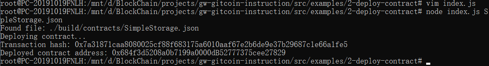

## Task 2: Deploy A Simple Ethereum Smart Contract On Polyjuice
#### A screenshot of the console output immediately after you have successfully deployed a smart contract:

#### The transaction hash from the contract deployment (in text format):
0x7a31871caa8080025cf88f683175a6010aaf67e2b6de9e37b29687c1e66a1fe5
#### The deployed contract address from the contract deployment (in text format):
0x684f3d5208a0b7199a0000dB52777375cee27829
