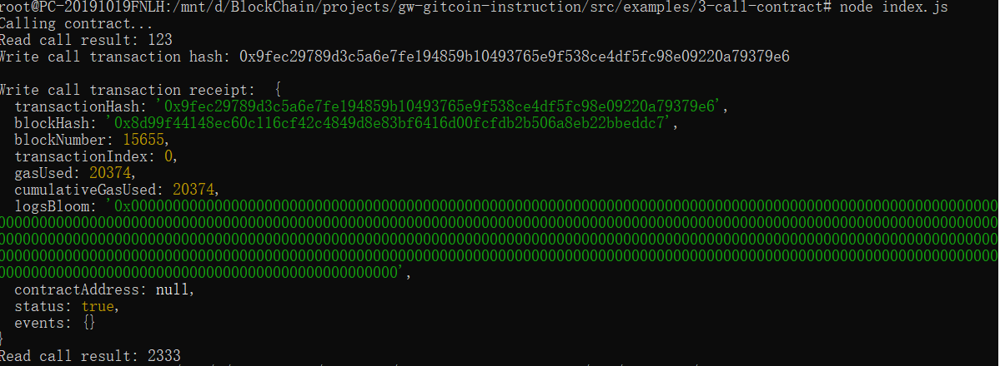

## Gitcoin: 3) Issue A Smart Contract Call To The Deployed Smart Contract

#### 1. A screenshot of the console output immediately after you have successfully issued a smart contract call.

#### 2. The transaction hash from the console output (in text format).
0x9fec29789d3c5a6e7fe194859b10493765e9f538ce4df5fc98e09220a79379e6
#### 3. The contract address that you called (in text format).
0x684f3d5208a0b7199a0000dB52777375cee27829
#### 4. The ABI for contract you made a call on (in text format).
```json
[
    {
      "inputs": [],
      "stateMutability": "payable",
      "type": "constructor"
    },
    {
      "inputs": [
        {
          "internalType": "uint256",
          "name": "x",
          "type": "uint256"
        }
      ],
      "name": "set",
      "outputs": [],
      "stateMutability": "payable",
      "type": "function"
    },
    {
      "inputs": [],
      "name": "get",
      "outputs": [
        {
          "internalType": "uint256",
          "name": "",
          "type": "uint256"
        }
      ],
      "stateMutability": "view",
      "type": "function"
    }
  ]
```
