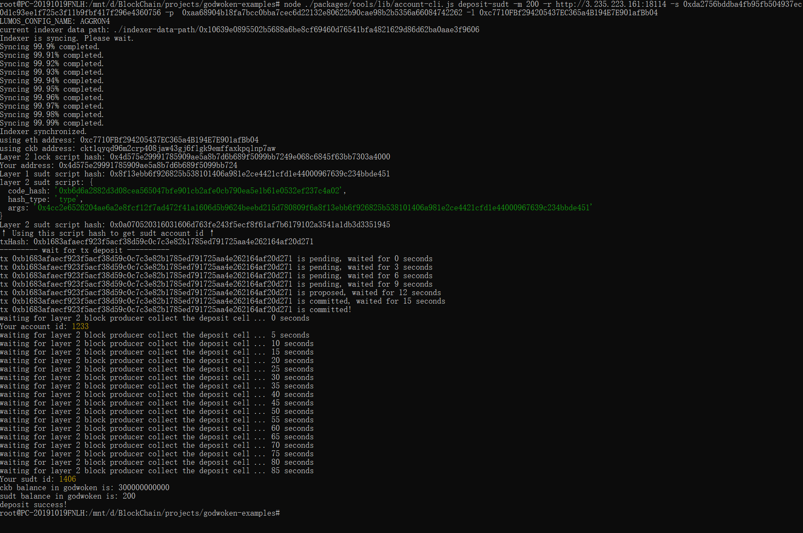

## Gitcoin: 4) Issue An SUDT Token On Layer 1 And Deposit It To Layer 2

### [Link to the Layer 1 address I funded on the Testnet Explorer.](https://explorer.nervos.org/aggron/address/ckt1qyqd96m2crp408jaw43gj6flgk9emffaxkpqlnp7aw)

Screenshot of he console output immediately after using sudt-cli to create my SUDT tokens on Layer 1.

### [Link to the transaction ID created by sudt-cli on the Testnet Explorer.](https://explorer.nervos.org/aggron/transaction/0x1e755edd552ac5a1b26a739d6f1471ddb413d84f91b4d62de9853384ada3afbb)

Screenshot of the console output immediately after I have successfully submitted a deposit to Layer 2 using the account-cli tool.

### SUDT ID: 1406
