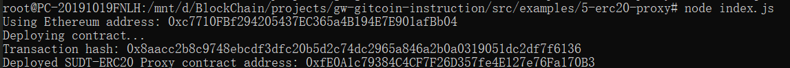
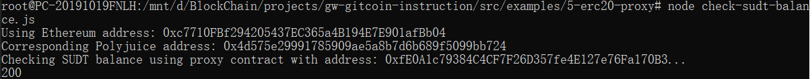
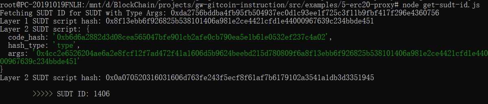

## Gitcoin: 5) Deploy The ERC20 Proxy Contract For The Deposited SUDT

#### A screenshot of the console output immediately after deploying smart contract.

#### The address of the ERC20 Proxy Contract you deployed (in text format).
0xfE0A1c79384C4CF7F26D357fe4E127e76Fa170B3
#### A screenshot of the console output immediately after checking your SUDT balance.

#### The Ethereum address that was checked (in text format).
0xc7710FBf294205437EC365a4B194E7E901afBb04
#### Bonus

