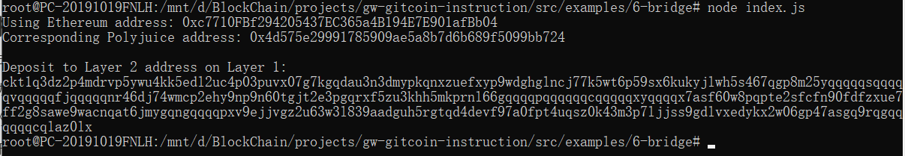

## Gitcoin: 6) Use Force Bridge To Deposit Tokens From Ethereum To Polyjuice

####  screenshot of the console output immediately after you have successfully generated your Deposit Receiver Address.

#### Your Deposit Receiver Address (in text format).

ckt1q3dz2p4mdrvp5ywu4kk5edl2uc4p03puvx07g7kgqdau3n3dmypkqnxzuefxyp9wdghglncj77k5wt6p59sx6kukyjlwh5s467qgp8m25yqqqqqsqqqqqvqqqqqfjqqqqqnr46dj74wmcp2ehy9np9n60tgjt2e3pgqrxf5zu3khh5mkprnl66gqqqqpqqqqqqcqqqqqxyqqqqx7asf60w8pqpte2sfcfn90fdfzxue7ff2g8sawe9wacnqat6jmygqngqqqqpxv9ejjvgz2u63w3l839aadguh5rgtqd4devf97a0fpt4uqsz0k43m3p7ljjss9gdlvxedykx2w06gp47asgq9rqgqqqqqqcqlaz0lx

#### The Ethereum address used to generate the Deposit Receiver Address (in text format).

0xc7710FBf294205437EC365a4B194E7E901afBb04

#### A link to the Etherscan explorer for the successful Force Bridge transaction. This can be found on Force Bridge under History→Succeed.

https://rinkeby.etherscan.io/tx/0x24f1784e6d3ee5acecf8d2f52d93ba2aa054fd87814bbbfcba9f5829499fba91

#### A link to the Nervos explorer for the successful Force bridge transaction. This can be found on Force Bridge under History→Succeed.

https://explorer.nervos.org/aggron/transaction/0xb15a502534b8ed47b438333fe83bcaba0b61416eed531c6ed6cacd17c82fd22d

