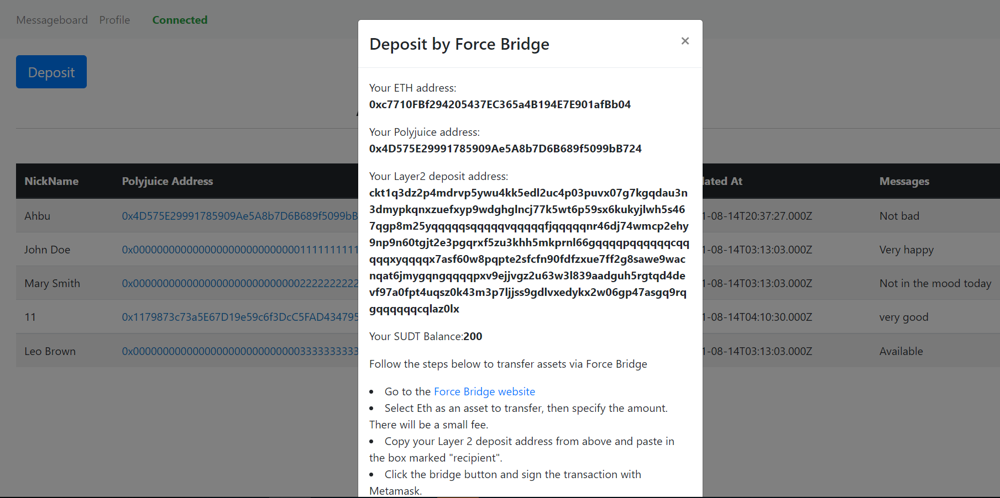
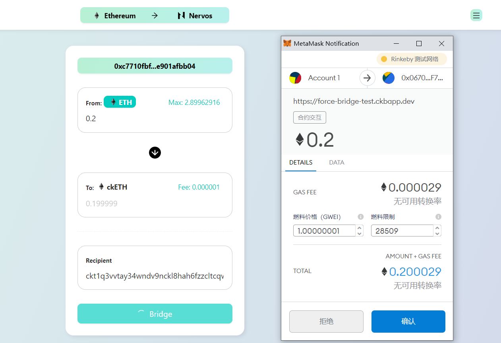

1. A screenshot or video of your EVM application on Layer 2 with Force Bridge support.

2. The address of the SUDT-ERC20 Proxy Contract that you deployed (in text format): 0xfE0A1c79384C4CF7F26D357fe4E127e76Fa170B3

3. A link to the GitHub repository with your EVM application that integrates Force Bridge support: https://github.com/Kizna1ver/CKBProjects/tree/main/task7/messageboard